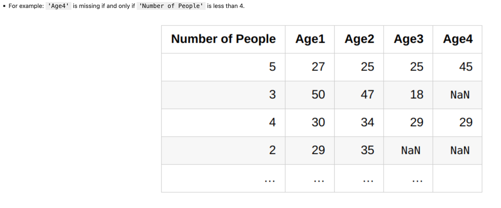
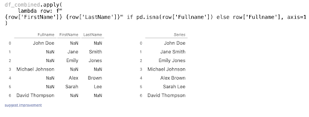
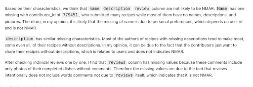
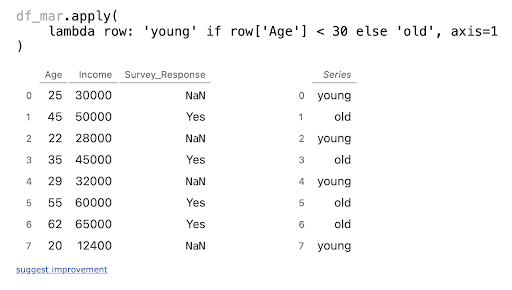
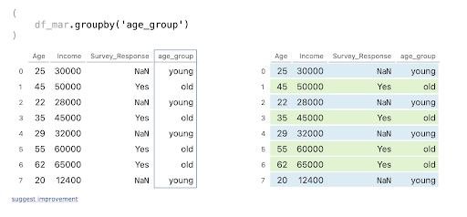

# Missingness guide

## Introduction

This page guide you through the types of missingness we learned in DSC80. The lecture slides already have
a good explantion on them, but if you want to have a more intuitive understanding, this page is for you.
It is important to understand this concept for project 3 and tests. I will mainly be focusing on NMAR since
(in my interpretation) it is the most difficult one to understand.

- [Missing by design (MD).](#missing-by-design-md)
- [Not missing at random (NMAR)](#not-missing-at-random-nmar)
- [Missing at random (MAR).](#missing-at-random-mar)
- [Missing completely at random (MCAR).](#missing-completely-at-random-mcar)

## Missing by design (MD)

This type of missingness is often the easiest to understand. It is solely based on the design of the data collection
process, where the designers intentionally decided to not collect data in that column.

> notes from lecture (I will use this to represent notes from lecture)):
> - the designers of the data collection process intentionally decided to not collect data in that column,
    because it can be recovered from other columns.
> - If you can determine whether a value is missing solely using other columns, then the data is missing by design.
    This confusion in design in one or several columns can be well understood by the other columns in the same
    dataframe.

> example from lecture:
> 

Example on Pandas Tutors:

note: I think MD is very easy to understand with class materials, I can add more if anyone think more is needed.

## Not missing at random (NMAR)

{I dont know if this makes sense, but here is my interpretation of it. Also incorporate my thoughts about in what level
of
understanding we should have in dsc80}

> The chance that a value is missing depends on the actual missing value!

This statement was very confusing to me at first by reading the text itself. so here are examples from class.

> Example: On an employment survey, people with really high incomes may be less likely to report their income.
>
> If we ignore missingness and compute the mean salary, our result will be biased low!
>
> Example: A person doesn't take a drug test because they took drugs the day before.
>
> When data is NMAR, we must reason about why the data is missing using domain expertise on the data generating
> process – the other columns in our data won't help.

Emmm, I still don't understand (me from the past): **If you say that "result can be biased low" because of the kind of
people that reports, isn't this just MAR? Then how would you differentiate NMAR and MAR?**

In the sense dsc80, I think instead of arguing in depth whether some missingness is truely NMAR or MAR, we are more
focused on
how you can differentiate a NMAR senario from a MAR senario. In short, we are looking at
> When data is NMAR, we must reason about why the data is missing using domain expertise on the data generating
> process – the other columns in our data won't help. (or reason about collecting more data)
> 
> Data is MAR if the chance that a value is missing depends on other columns, but not the actual missing value itself.

*Especially in project 3, we are more focused on whether you can correctly argue for NMAR and MAR.*
*and in addition to that here is my justification of NMAR on project 3 and can use to guide students, I can change it to a 
another dataset that isnt used now*

<b>not wordy version</b>

In summary, the difference between NMAR (Not Missing At Random) and MAR (Missing At Random) relates to whether missing
data in a dataset can be inferred from other available data. In MAR, missing values can be predicted using other columns
in the dataset. In contrast, NMAR refers to situations where missingness cannot be determined from the data present.

The distinction between NMAR and MAR can vary depending on the dataset's variables. For instance, in a survey, the
presence of certain columns (like job title in an employment survey) can change missingness from NMAR to MAR, as these
columns help predict missing values.

However, determining missingness can be complex, especially in situations like voluntary surveys where participant
bias (like satisfaction or dissatisfaction among employees) can influence responses. To address these complexities,
various imputation methods are used, such as Model-Based Imputation, which uses statistical models to predict missing
values, and Hot Deck Imputation, where missing values are filled using data from similar respondents.

  <b>wordy version</b>

There isnt a big different in NMAR and MAR, they differentiate in the existence of dependencies on the
missingness in the dataframe. In MAR, we can use other columns to determine the missingness, but in NMAR, we can't. It
is important
to notice that at some level, NMAR and MAR are interchangeable based on the columns given by the dataframe. For example,
in the employment survey example, if we have a column that indicates the job title, we can use that column to determine
the missingness of the income column. In this case, the missingness is MAR. However, if we don't have that column (or
any relevant column), we can't determine the missingness of the income column. In this case, the missingness is NMAR.
In the drug test example, if we have a history of drug usage column, we can use that column to determine the missingness
of the drug test column. In this case, the missingness is MAR.

These are some easy domain knowledge to acquire, but in some cases, it is not that easy.
For example, In a voluntary survey, the decision to participate can be influenced by the very subject the survey seeks
to measure.
This can introduce a form of selection bias:

- Dissatisfied Employees: Those who are dissatisfied might be more inclined to participate as they see the survey as a
  platform to express their grievances. Conversely, they might also choose not to participate due to a sense of futility
  or disengagement.
- Satisfied Employees: Similarly, satisfied employees might be more likely to respond to show their positive
  experiences.
  However, they might also not participate if they feel there’s nothing to add or if they are complacent.
  These uncertainties can lead to one direction of bias due to the questions on surveys or some other factors.

These questions are always hard to answer, and a big part of resolution to this is incorporate these uncertainties into
survey design or imputation.

Aside from the ones we learned in class, there can be:

- Model-Based Imputation: These methods use statistical models (like regression models) to predict missing values based
  on the observed data. These models can be quite sophisticated, taking into account various factors that might influence
  the likelihood of missingness.
- Hot Deck Imputation: This method involves filling in missing values with observed responses from similar respondents.
  The 'similar' respondents are typically identified based on other variables in the dataset.

## Missing at random (MAR) and Missing completely at random (MCAR)

### Missing at random (MAR)

In general, MAR and MCAR are covered comprehensively in lecture, and it is not that hard to understand. I will just
briefly go over them.

Missing at Random (MAR) occurs when the probability of data being missing is related to the observed data, but not the
missing data itself. In MAR, the cause of the missing data can be explained by variables for which we have information.

You can treat this sort of like the opposite of NMAR: In MAR, we can use other columns to determine the missingness, but
in
NMAR, we can't. In the sense of dsc80, if look through the columns and can find at least 1 column that can help you
determine
the missingness, then it is MAR. If you can't, then it is NMAR.

- **Example:** In a survey, if people with higher income levels tend to skip the income question more often, and if we
  know the respondents' job titles, the missingness of income data is MAR.

In the class, we have learned with examples that explain circumstances where the missingness is MAR. I think they are
pretty good examples and are enough to understand MAR.

### Missing completely at random (MCAR)

Missing Completely at Random (MCAR) means the missingness of data is completely independent of both observed and
unobserved data. In MCAR, the missing data points are a random subset of the data.

In real life, it is nearly impossible to have MCAR. You know, relationships between data are everywhere, it is just
whether you know it or not. However, it is a good assumption to make when we are trying to
understand the data. It is also a good assumption to make when we are trying to impute the missing data.

- **Example:** If survey responses are missing due to random factors like accidental data loss or respondents randomly
  skipping questions without any specific pattern, the missingness is MCAR.

> ### Deciding between MCAR and MAR
> - For data to be MCAR, the chance that values are missing should not depend on any other column or the values
    themselves.
> - **Example:** Consider a dataset of phones, in which we store the screen size and price of each phone. Some prices
    are missing.

| Phone             | Screen Size | Price |
|-------------------|-------------|-------|
| iPhone 14         | 6.06        | 999   |
| Galaxy Z Fold 4   | 7.6         | NaN   |
| OnePlus 9 Pro     | 6.7         | 799   |
| iPhone 13 Pro Max | 6.68        | NaN   |

> - If prices are MCAR, then the distribution of screen size should be the same for:

- phones whose prices are missing, and
- phones whose prices aren't missing.

> - We can use a permutation test to decide between MAR and MCAR! We are asking the question, did these two samples come
    from the same underlying distribution?

Here is a trivial example drawn using the Pandas Tutors, you can see that young age group tend to have more missing
values in survey response columns while old age group tend to have less missing values in survey response columns.

    

    
